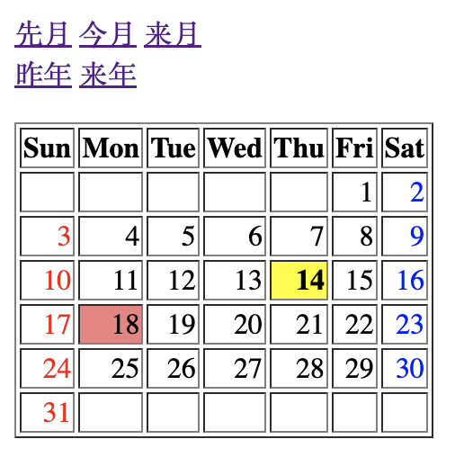

# webcal


## Overview
Calender application with Sinatra

## Dependences
WebFramework : Sinatra  
Database : sqlite3(v3.31.1)  
Ruby(v3.0.1)  

To install dependences
```
bundle install
```

## Feature
- [x] Basic calender feature
- [x] Apply yellow bg to today
- [x] Add link to next (month|year) and last (month|year)
- [x] Accept Gengo (S|H|R)\d URL parameter
- [x] Don't Accept negative parameter
- [x] Color Sunday red and Saturday blue
- [x] Apply reddish bg to holiday

# LICENSE
MIT
